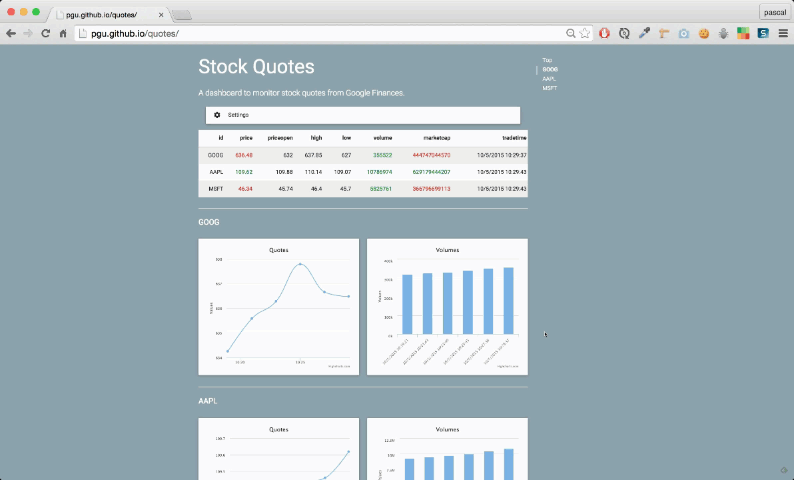
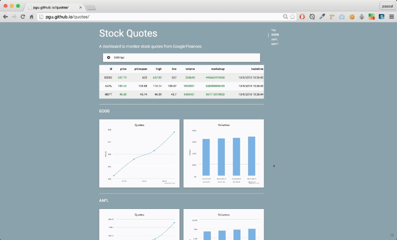

## Real-time stock quotes from Google Finance with APISpark :honeybee:

The demo is a dashboard that monitors the data of Google Finance through a real-time API.

- [Demo application](http://fabiennelaunay.github.io/restlet-quotes/)
- [Screencast](TODO add webcast URL)
- [Blog post](http://restlet.com/blog/2015/10/28/real-time-stock-quotes-from-google-finance-with-apispark/)

It shows how to integrate the following technologies:
- [Google Finance](https://www.google.com/finance)
- [Google Sheets](https://www.google.com/sheets/about/)
- [APISpark](http://restlet.com/)
- [Streamdata.io](http://streamdata.io/)

and to build the dashboard, we used:
- [AngularJS](https://angularjs.org/)
- [MaterialCSS](materializecss.com/)
- [HighCharts](http://www.highcharts.com/)

## Examples

